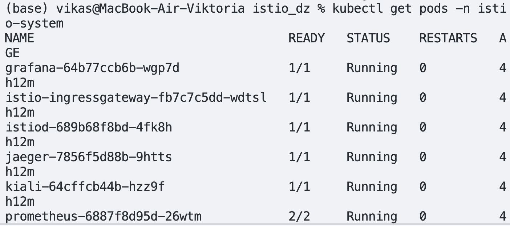
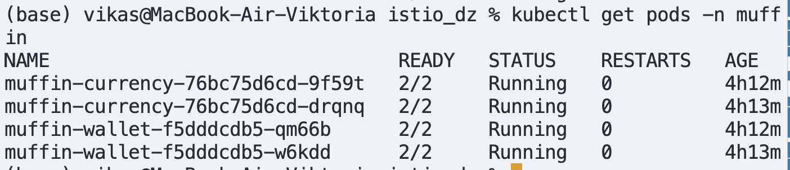
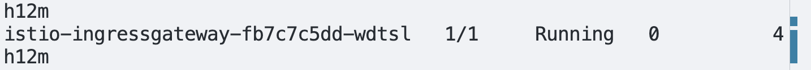
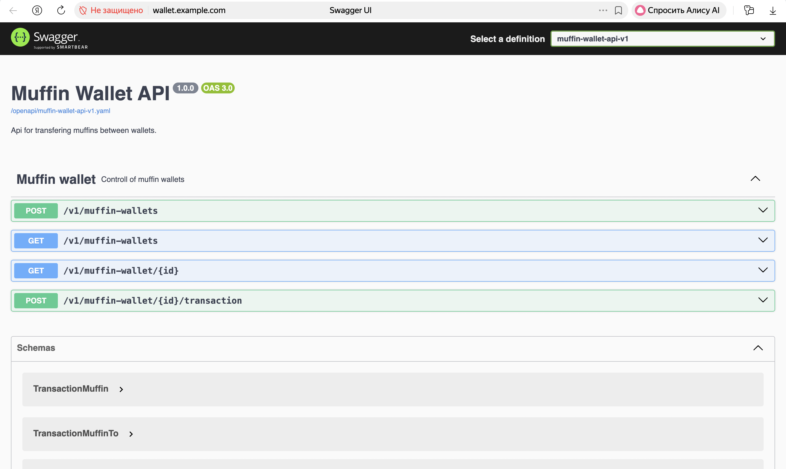
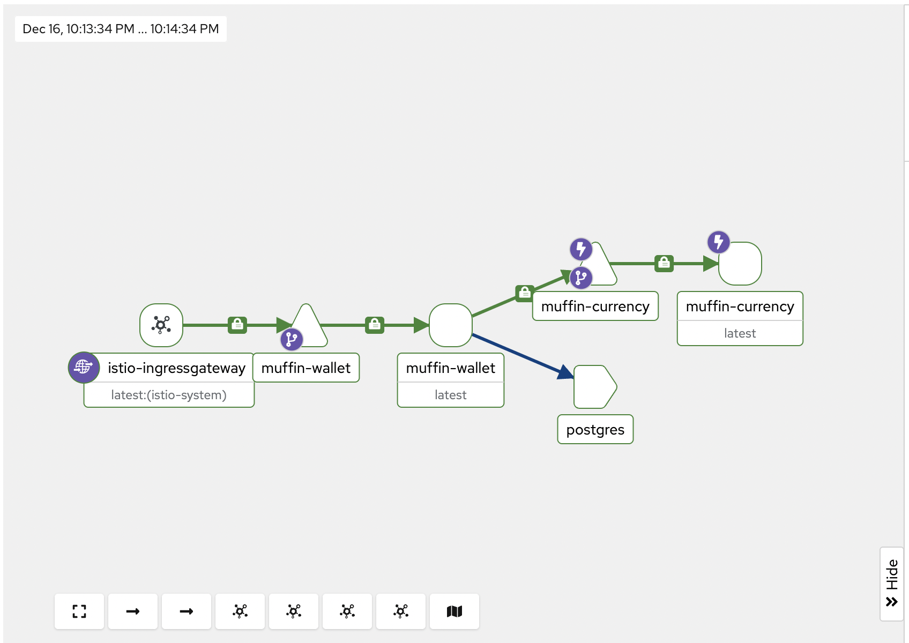
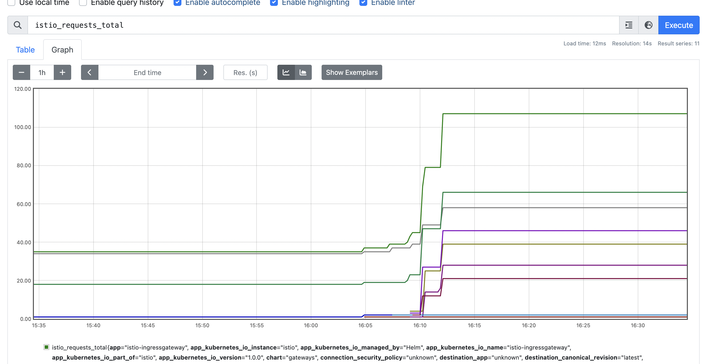
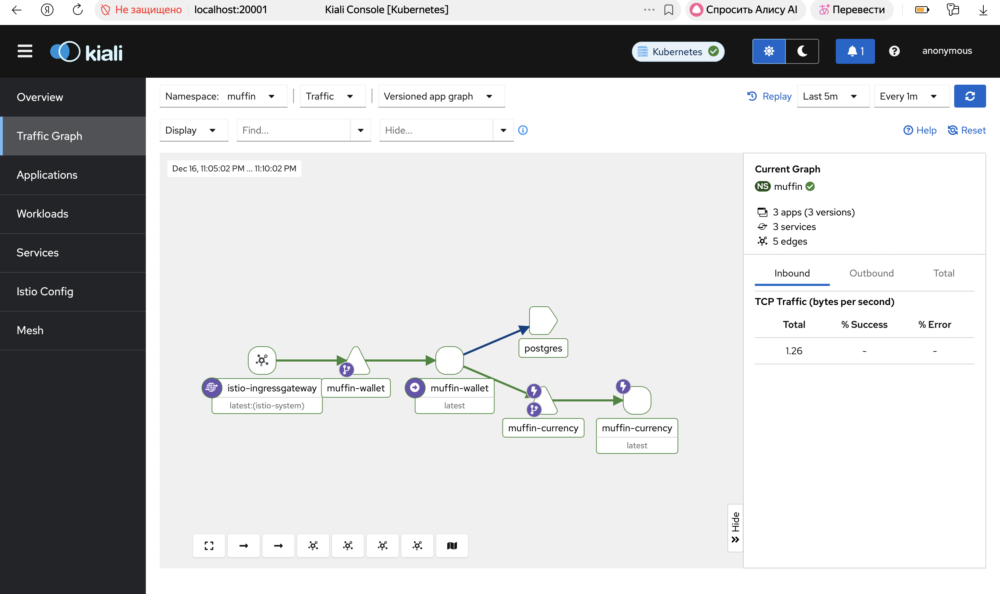
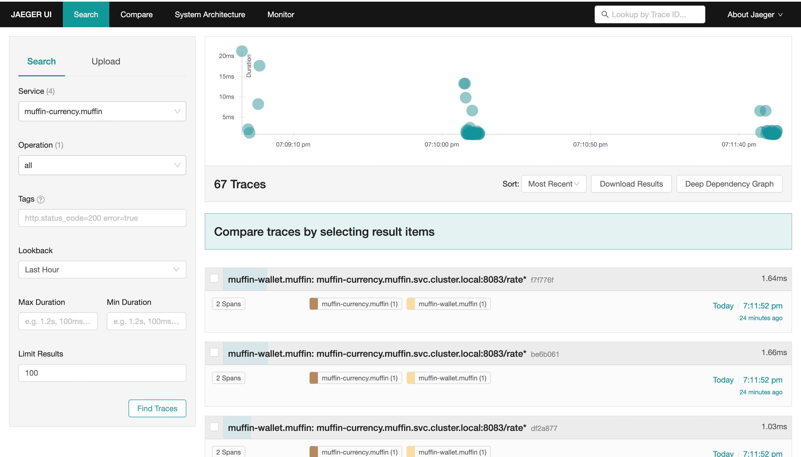
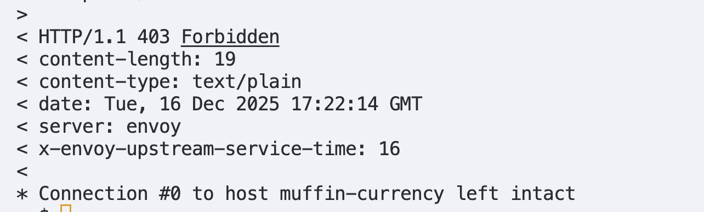

# Домашнее задание по ПРСП istio + helm
## Helmfile
Приложение разворачивается через helmfile. 
## Установка istio
istio установлен с помощью команды istioctl install. В кластере есть компоненты из control plane istio


создается namespace muffin, который помечается автоматической инжекцией сайдкар прокси. 

на скриншоте видно, что в каждом поде 2 контейнера: с приложением и с энвоем. 

## Конфигурация istio
### Ingress Gateway:

Istio Ingress Gateway был установлен вместе с istio и запущен в namespace istio-system:

для обработки внешнего трафика был создан ресурс Gateway (istio/gateway.yaml), для маршрутизации трафика внутри меша был создан VirtualService (istio/virtualservice.yaml).
По адресу wallet.example.com становится доступен сервис.  

В Kiali рисуется граф:


### Observability:
Установлены Kiali, Prometheus для сбора метрик и визуализации трафика. Для трейсинга был установлен Jaeger.

 
#### Prometheus
`istioctl dashboard prometheus`

#### Kiali
`istioctl dashboard kiali`

#### Jaeger
`istioctl dashboard jaeger`


### Security:
Для шифрования трафика был включен mtls через ресурс PeerAuthentication(istio/peerauthentication.yaml)
Для того, чтобы запросы к muffin-currency проходили только через muffin-wallet и никак иначе, была настроена AuthorizationPolicy (istio/authpolicy.yaml)

Замки на ребрах означают включенный mtls. mtls к serviceEntry постгреса пришлось выключить через костыль postgresdisablemtls.yaml, с ним падали контейнеры приложения. 

Для проверки политики создадим тестовый под в кластере (test/testcurl.yaml), из которого будем стучать в muffin-currency. 
Зайдем внутрь пода:
```sh
kubectl exec -n muffin -it test-curl -c curl -- sh
```
И сходим к muffin-currency:
```sh
curl -v http://muffin-currency:8083/rate
```
Получаем 403 от энвоя:


### Resilience:
Для сервиса muffin-currency настроены правила ретраев и таймаутов с помощью VirtualService (resiliencevs.yaml), для сервиса muffin-currency настроен Circuit Breaker с помощью DestinationRule(destinationrule.yaml)

Для входящего трафика настроен фильтр EnvoyFilter(envoyfilter.yaml), который ограничивает количество запросов на ingress


### VirtualService, ServiceEntry, Gateway :
PostgreSQL не является частью кластера, развернут через докер. Взаимодействие с ним происходит через ServiceEntry(serviceentry.yaml).  

## Запуск
1. Установить istio в кластер по инструкции из документации. Установить Kiali, Jaeger, Prometheus по инструкции из документации.
2. Поднять БД (postgres/docker-compose)
3. `helmfile apply`
4. `kubectl apply -f istio/`

